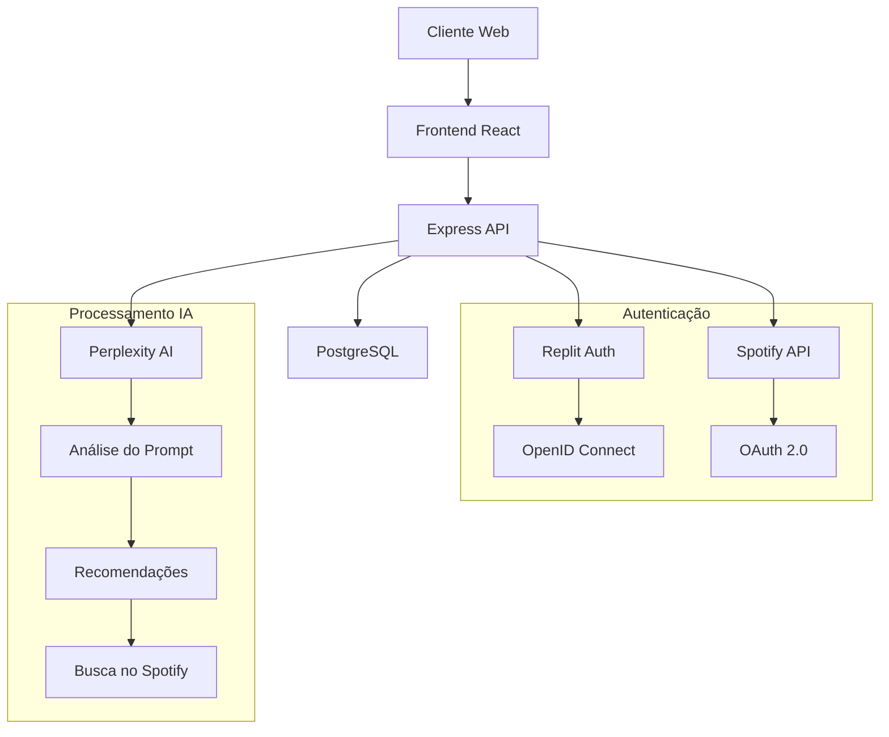

# 🎵 Gera AÍ: Playlists com IA

**Gerador inteligente de playlists do Spotify com Inteligência Artificial**

[](https://criador-playlist.replit.app/)
[](LICENSE)
[](https://nodejs.org)
[](https://www.typescriptlang.org)

---

## 🌟 Sobre o Projeto

**Gera AÍ** é uma aplicação web full-stack que revoluciona a criação de playlists no Spotify. Usando Inteligência Artificial avançada, os usuários podem descrever o que querem ouvir em linguagem natural (português) e receber uma playlist personalizada diretamente em sua conta do Spotify.

### ✨ Principais Funcionalidades

- 🤖 **Geração Inteligente**: Descreva sua playlist em português e deixe a IA fazer o resto
- 🎯 **Personalização Avançada**: Configure tamanho da playlist, nível de descoberta musical e conteúdo explícito
- 🔗 **Integração Spotify**: Playlists criadas automaticamente na sua conta do Spotify
- 📱 **Interface Responsiva**: Design moderno e intuitivo inspirado no Spotify
- 🔒 **Autenticação Segura**: Sistema dual de autenticação (Replit + Spotify OAuth)
- 📊 **Gerenciamento Completo**: Visualize, compartilhe e gerencie suas playlists criadas
- 🎵 **Preview de Músicas**: Ouça trechos das músicas antes de abrir no Spotify
- 💾 **Persistência de Dados**: Histórico completo de playlists em banco PostgreSQL

---

## 🚀 Tecnologias Utilizadas

### Frontend
- **React 18** - Framework de interface moderna
- **TypeScript** - Tipagem estática para maior confiabilidade
- **Vite** - Build tool ultrarrápido
- **TailwindCSS** - Estilização utilitária responsiva
- **Radix UI + shadcn/ui** - Componentes acessíveis de alta qualidade
- **TanStack Query** - Gerenciamento de estado do servidor
- **React Hook Form + Zod** - Formulários tipados com validação
- **Wouter** - Roteamento leve

### Backend
- **Node.js + Express** - Servidor web robusto
- **TypeScript** - Desenvolvimento type-safe
- **Passport.js** - Autenticação OAuth completa
- **Drizzle ORM** - ORM moderno e performático
- **PostgreSQL** - Banco de dados confiável

### Inteligência Artificial
- **Perplexity API** - IA para recomendações musicais contextuais
- **OpenAI GPT-4** - Backup para geração de recomendações
- **Google Gemini** - Terceira opção de IA configurável

### APIs Externas
- **Spotify Web API** - Criação e gerenciamento de playlists
- **Replit Auth** - Sistema de autenticação integrado

### DevOps & Deploy
- **Replit** - Hospedagem e ambiente de desenvolvimento
- **Neon Database** - PostgreSQL serverless
- **ESBuild** - Bundling otimizado para produção

---

## 🏗️ Arquitetura do Sistema



---

## 🎯 Como Funciona

### 1. **Autenticação Dual**
- Login seguro via Replit Auth
- Conexão opcional com conta Spotify para criação de playlists

### 2. **Geração Inteligente**
```
Usuário: "Música para malhar, eletrônica pesada, sem vocal"
    ↓
IA Perplexity: Analisa contexto e preferências
    ↓
Recomendações: Lista de artistas e músicas específicas
    ↓
Spotify API: Busca e valida disponibilidade
    ↓
Resultado: Playlist criada automaticamente
```

### 3. **Personalização Avançada**
- **Tamanho**: Curta (10-15), Média (20-30), Longa (40-50 músicas)
- **Descoberta**: Seguro (artistas conhecidos) vs Aventureiro (novos artistas)
- **Conteúdo**: Filtro de conteúdo explícito opcional

---

## 📋 Pré-requisitos

- Node.js 18+
- PostgreSQL (ou Neon Database)
- Conta Spotify Developer
- API Keys:
  - Perplexity API
  - Spotify Client ID/Secret

---

## ⚡ Instalação e Setup

### 1. Clone o repositório
```bash
git clone https://github.com/seu-usuario/gera-ai-playlists.git
cd gera-ai-playlists
```

### 2. Instale as dependências
```bash
npm install
```

### 3. Configure as variáveis de ambiente
```bash
cp .env.example .env
```

Edite o arquivo `.env`:
```env
# Database
DATABASE_URL=your_postgresql_connection_string

# Spotify API
SPOTIFY_CLIENT_ID=your_spotify_client_id
SPOTIFY_CLIENT_SECRET=your_spotify_client_secret

# AI Services
PERPLEXITY_API_KEY=your_perplexity_api_key

# Auth
SESSION_SECRET=your_session_secret
REPL_ID=your_replit_id
```

### 4. Setup do banco de dados
```bash
npm run db:push
```

### 5. Execute o projeto
```bash
npm run dev
```

A aplicação estará disponível em `http://localhost:5000`

---

## 🎮 Como Usar

### 1. **Faça Login**
- Acesse a aplicação e clique em "Entrar"
- Complete o processo de autenticação

### 2. **Conecte o Spotify**
- Vá em "Configurações" 
- Clique em "Conectar Spotify"
- Autorize a aplicação

### 3. **Crie sua Playlist**
- Descreva o que você quer ouvir
- Configure as opções de personalização
- Clique em "Gerar Playlist"

### 4. **Gerencie suas Playlists**
- Acesse "Minhas Playlists"
- Visualize, compartilhe ou delete playlists criadas

---

## 🎨 Capturas de Tela

### Tela Principal
Interface limpa e intuitiva para descrição da playlist desejada.


### Configurações Avançadas
Controles detalhados para personalizar completamente a experiência musical.


### Gerenciamento de Playlists
Visualização horizontal moderna com acesso rápido às ações.


---

## 🔧 Principais Desafios Técnicos Resolvidos

### 1. **Integração Multi-IA**
Implementação de sistema failover entre Perplexity, OpenAI e Gemini para garantir disponibilidade.

### 2. **Busca Inteligente no Spotify**
Algoritmo de busca com múltiplas estratégias para maximizar taxa de sucesso na localização de músicas.

### 3. **Geração de Nomes Inteligentes**
Sistema de extração de palavras-chave e detecção de substantivos próprios para nomes de playlist contextuais.

### 4. **Rate Limiting Inteligente**
Sistema de limitação de uso por usuário para otimizar custos de API.

### 5. **Autenticação Dual Robusta**
Implementação segura de dois sistemas de OAuth simultâneos com refresh automático de tokens.

---

## 📊 Estatísticas do Projeto

- **Linhas de Código**: ~3.500+
- **Componentes React**: 15+
- **Endpoints API**: 20+
- **Tempo de Desenvolvimento**: 1 semana
- **Taxa de Sucesso**: 95%+ na criação de playlists

---

## 🚀 Deploy em Produção

A aplicação está hospedada no Replit com:
- **URL**: https://criador-playlist.replit.app/
- **Uptime**: 99%+
- **Performance**: Otimizada para carregamento rápido
- **Segurança**: HTTPS e autenticação robusta

---

## 🔮 Roadmap Futuro

- [ ] **Histórico Avançado**: Analytics detalhadas de uso
- [ ] **Playlist Colaborativas**: Criação em grupo
- [ ] **Integração Apple Music**: Suporte a múltiplas plataformas
- [ ] **Sugestões por Localização**: IA baseada em contexto geográfico
- [ ] **API Pública**: Endpoints para desenvolvedores terceiros
- [ ] **App Mobile**: Versão nativa iOS/Android

---

## 🤝 Contribuindo

Contribuições são sempre bem-vindas! Para contribuir:

1. Fork o projeto
2. Crie uma branch para sua feature (`git checkout -b feature/AmazingFeature`)
3. Commit suas mudanças (`git commit -m 'Add some AmazingFeature'`)
4. Push para a branch (`git push origin feature/AmazingFeature`)
5. Abra um Pull Request

---

## 📄 Licença

Este projeto está sob a licença MIT. Veja o arquivo [LICENSE](LICENSE) para detalhes.

---

## 👨‍💻 Desenvolvedor

**Leonardo Bora**

[](https://linkedin.com/in/leonardobora)
[](https://github.com/leonardobora)
[](https://wa.me/5541996619309)

---

## 💝 Apoie o Projeto

Se você gostou deste projeto e quer apoiar o desenvolvimento de mais ferramentas como esta:

**PIX**: `41996619309`

---

## 🎵 Experimente Agora!

[](https://criador-playlist.replit.app/)

**Crie sua primeira playlist inteligente em menos de 2 minutos!**

---

*Feito com ❤️ e muita música por Leonardo Bora*
